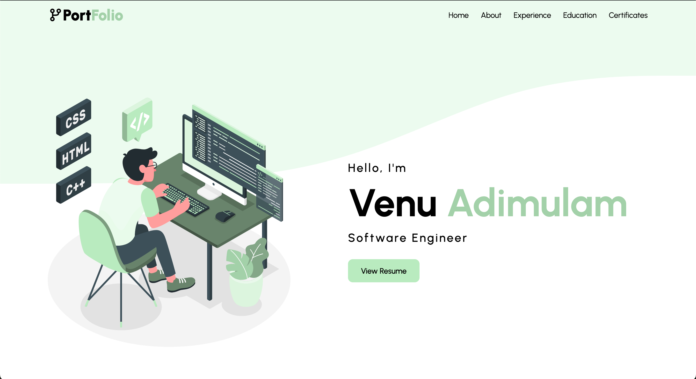
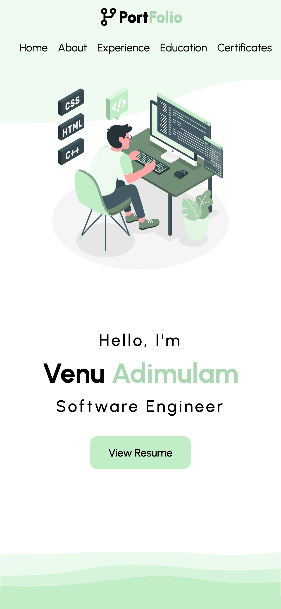

# Portfolio

Welcome to my Full Stack Developer portfolio! 👋 I'm Venu Adimulam, a passionate and detail-oriented developer with expertise in both front-end and back-end technologies. I love turning ideas into robust, scalable, and user-friendly applications.

URL: https://venuadhimulam.github.io/Portfolio/

## About Me

I have a strong foundation in full-stack development, with a focus on creating seamless user experiences. My technical skills include:

- **Front-End:** HTML, CSS, JavaScript, React, Bootstrap
- **Back-End:** Java, Spring, Spring Boot, Python, Node.js, Express.js
- **Databases:** MongoDB, MySQL, PostgreSQL, MSSQL
- **Version Control:** Git, GitHub
- **Deployment:** AWS, Firebase
- **Other Tools:** RESTful APIs, Docker, CI/CD, Jenkins 

Feel free to explore my projects and reach out if you have any questions or opportunities for me!

## Landing Page Screenshots

### Web View

### Mobile View
